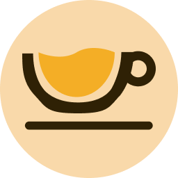

<!-- Improved compatibility of back to top link: See: https://github.com/othneildrew/Best-README-Template/pull/73 -->

<a name="readme-top"></a>

<!--
*** Thanks for checking out the Best-README-Template. If you have a suggestion
*** that would make this better, please fork the repo and create a pull request
*** or simply open an issue with the tag "enhancement".
*** Don't forget to give the project a star!
*** Thanks again! Now go create something AMAZING! :D
-->

[![Contributors][contributors-shield]][contributors-url]
[![Forks][forks-shield]][forks-url]
[![Stargazers][stars-shield]][stars-url]
[![Issues][issues-shield]][issues-url]
[![MIT License][license-shield]][license-url]
[![LinkedIn][linkedin-shield]][linkedin-url]

<!-- PROJECT SHIELDS -->
<!--
*** I'm using markdown "reference style" links for readability.
*** Reference links are enclosed in brackets [ ] instead of parentheses ( ).
*** See the bottom of this document for the declaration of the reference variables
*** for contributors-url, forks-url, etc. This is an optional, concise syntax you may use.
*** https://www.markdownguide.org/basic-syntax/#reference-style-links
-->

<!-- PROJECT LOGO -->
<br />
<div align="center">
  <a href="https://github.com/othneildrew/Best-README-Template">
    
  </a>

  <h3 align="center">Cafe Street UI Kit</h3>

  <p align="center">
    Code implementation of <a href='https://www.figma.com/community/file/1138256358581554095/Cafe-Street---E-Commerce-Landing-Page'>Cafe Street UI Kit</a>
    <br/>
    <br/>
    
    <br />
    <a href="https://cafe-street.vercel.app/">View Demo</a>
    ·
    <a href="https://github.com/Silvrash/cafe-street/issues">Report Bug</a>
    ·
    <a href="https://github.com/Silvrash/cafe-street/issues">Request Feature</a>
  </p>
</div>

<!-- ABOUT THE PROJECT -->

## About The Project

Cafe Street is a UI kit design by <a href='https://www.figma.com/@rauliqbal'>Rauliqbal</a> and implemented as a code project.

The UI kit is designed to provide a seamless and user-friendly experience for ordering coffee, with a focus on modern design and functionality.
The code implementation of the Cafe Street UI kit is just a challenge to the author of this code.

<span>
  
</span>

<br/><br/><br/>
 -->

### Built With

-   [![React][React.js]][React-url]
-   [](http://nextjs.org)

<!-- GETTING STARTED -->

## Getting Started

To get a local copy up and running follow these simple example steps.

### Prerequisites

This is an example of how to list things you need to use the software and how to install them.

### Installation

1. Clone the repo
    ```sh
    git clone https://github.com/Silvrash/cafe-street.git
    ```
2. Install NPM packages
    ```sh
    yarn install
    ```
3. To start the development server
    ```sh
    yarn dev
    ```

<!-- USAGE EXAMPLES -->

## Build Usage

1. Build
    ```sh
    yarn build
    ```
2. Run build
    ```sh
    yarn start
    ```

<!-- LICENSE -->

## License

Distributed under the GNU General Public License. See `LICENSE` for more information.

<!-- CONTACT -->

## Contact

Benjamin Arko Afrasah - [@silvrash]([https://github.com/Silvrash]) - barkoafrasah@gmail.com

Project Link: [https://github.com/Silvrash/cafe-street](https://github.com/Silvrash/cafe-street)

<!-- ACKNOWLEDGMENTS -->

## Acknowledgments

Use this space to list resources you find helpful and would like to give credit to. I've included a few of my favorites to kick things off!

-   [Rauliqbal](https://www.figma.com/@rauliqbal)
-   [UI8](https://ui8.net)

<!-- MARKDOWN LINKS & IMAGES -->
<!-- https://www.markdownguide.org/basic-syntax/#reference-style-links -->

[contributors-shield]: https://img.shields.io/github/contributors/Silvrash/cafe-street.svg?style=plastic
[contributors-url]: https://github.com/Silvrash/cafe-street/graphs/contributors
[forks-shield]: https://img.shields.io/github/forks/Silvrash/cafe-street.svg?style=plastic
[forks-url]: https://github.com/Silvrash/cafe-street/network/members
[stars-shield]: https://img.shields.io/github/stars/Silvrash/cafe-street.svg?style=plastic
[stars-url]: https://github.com/Silvrash/cafe-street/stargazers
[issues-shield]: https://img.shields.io/github/issues/Silvrash/cafe-street.svg?style=plastic
[issues-url]: https://github.com/Silvrash/cafe-street/issues
[license-shield]: https://img.shields.io/github/license/Silvrash/cafe-street.svg?style=plastic
[license-url]: https://github.com/Silvrash/cafe-street/blob/master/LICENSE.txt
[linkedin-shield]: https://img.shields.io/badge/linkedin%20-%230077B5.svg?&style=plastic&logo=linkedin&logoColor=white
[linkedin-url]: https://linkedin.com/in/linkedin_username
[product-screenshot]: images/screenshot.png
[Next.js]: https://img.shields.io/badge/next.js-000000?style=plastic&logo=nextdotjs&logoColor=white
[Next-url]: https://nextjs.org/
[React.js]: https://img.shields.io/badge/React-20232A?style=plastic&logo=react&logoColor=61DAFB
[React-url]: https://reactjs.org/
[Vue.js]: https://img.shields.io/badge/Vue.js-35495E?style=plastic&logo=vuedotjs&logoColor=4FC08D
[Vue-url]: https://vuejs.org/
[Angular.io]: https://img.shields.io/badge/Angular-DD0031?style=plastic&logo=angular&logoColor=white
[Angular-url]: https://angular.io/
[Svelte.dev]: https://img.shields.io/badge/Svelte-4A4A55?style=plastic&logo=svelte&logoColor=FF3E00
[Svelte-url]: https://svelte.dev/
[Laravel.com]: https://img.shields.io/badge/Laravel-FF2D20?style=plastic&logo=laravel&logoColor=white
[Laravel-url]: https://laravel.com
[Bootstrap.com]: https://img.shields.io/badge/Bootstrap-563D7C?style=plastic&logo=bootstrap&logoColor=white
[Bootstrap-url]: https://getbootstrap.com
[JQuery.com]: https://img.shields.io/badge/jQuery-0769AD?style=plastic&logo=jquery&logoColor=white
[JQuery-url]: https://jquery.com
